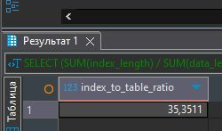

# Домашнее задание к занятию "`Индексы`" - `Лебедев Виктор`


### Инструкция по выполнению домашнего задания

   1. Сделайте `fork` данного репозитория к себе в Github и переименуйте его по названию или номеру занятия, например, https://github.com/имя-вашего-репозитория/git-hw или  https://github.com/имя-вашего-репозитория/7-1-ansible-hw).
   2. Выполните клонирование данного репозитория к себе на ПК с помощью команды `git clone`.
   3. Выполните домашнее задание и заполните у себя локально этот файл README.md:
      - впишите вверху название занятия и вашу фамилию и имя
      - в каждом задании добавьте решение в требуемом виде (текст/код/скриншоты/ссылка)
      - для корректного добавления скриншотов воспользуйтесь [инструкцией "Как вставить скриншот в шаблон с решением](https://github.com/netology-code/sys-pattern-homework/blob/main/screen-instruction.md)
      - при оформлении используйте возможности языка разметки md (коротко об этом можно посмотреть в [инструкции  по MarkDown](https://github.com/netology-code/sys-pattern-homework/blob/main/md-instruction.md))
   4. После завершения работы над домашним заданием сделайте коммит (`git commit -m "comment"`) и отправьте его на Github (`git push origin`);
   5. Для проверки домашнего задания преподавателем в личном кабинете прикрепите и отправьте ссылку на решение в виде md-файла в вашем Github.
   6. Любые вопросы по выполнению заданий спрашивайте в чате учебной группы и/или в разделе “Вопросы по заданию” в личном кабинете.
   
   Желаем успехов в выполнении домашнего задания.

---

---

Задание можно выполнить как в любом IDE, так и в командной строке.

### Задание 1

Напишите запрос к учебной базе данных, который вернёт процентное отношение общего размера всех индексов к общему размеру всех таблиц.

---

### Решение 1

Запрос
```
SELECT
    (SUM(index_length) / SUM(data_length + index_length)) * 100 AS index_to_table_ratio
FROM
    information_schema.TABLES
WHERE
    table_schema = 'sakila'; 
```

---

### Задание 2

Выполните explain analyze следующего запроса:
```sql
select distinct concat(c.last_name, ' ', c.first_name), sum(p.amount) over (partition by c.customer_id, f.title)
from payment p, rental r, customer c, inventory i, film f
where date(p.payment_date) = '2005-07-30' and p.payment_date = r.rental_date and r.customer_id = c.customer_id and i.inventory_id = r.inventory_id
```
- перечислите узкие места;
- оптимизируйте запрос: внесите корректировки по использованию операторов, при необходимости добавьте индексы.

---

### Решение 2

Создаем индексы
```
CREATE INDEX idx_payment_rental_id ON payment (rental_id);
CREATE INDEX idx_rental_customer_id ON rental (customer_id);
CREATE INDEX idx_rental_inventory_id ON rental (inventory_id);
CREATE INDEX idx_inventory_film_id ON inventory (film_id);
CREATE INDEX idx_payment_payment_date ON payment (payment_date);
```

Оптимизированный запрос
```
SELECT DISTINCT
    CONCAT(c.last_name, ' ', c.first_name) AS customer_name,
    SUM(p.amount) OVER (PARTITION BY c.customer_id, f.title) AS total_amount_per_film
FROM
    payment p
INNER JOIN
    rental r ON p.rental_id = r.rental_id  -- Corrected join: using rental_id
INNER JOIN
    customer c ON r.customer_id = c.customer_id
INNER JOIN
    inventory i ON r.inventory_id = i.inventory_id
INNER JOIN
    film f ON i.film_id = f.film_id  -- Added explicit link between inventory and film
WHERE
    DATE(p.payment_date) = '2005-07-30';
```
Изменения и пояснения:

1. Явные JOIN’ы (INNER JOIN): Заменили неявные JOIN’ы на явные INNER JOIN для улучшения читаемости и производительности. INNER JOIN возвращает только те строки, для которых есть соответствия в обеих таблицах.
2. Правильное условие соединения между payment и rental: Предполагается, что таблицы payment и rental связаны через rental_id. Использование p.rental_id = r.rental_id является логичным и стандартным. Если связь между payment и rental осуществляется другим способом (например, через payment_id), необходимо скорректировать это условие.
3. Добавлена явная связь между inventory и film: Условие f.film_id = i.film_id обеспечивает, что мы учитываем только те фильмы, которые действительно есть в инвентаре, который был взят в аренду.
4. Псевдонимы таблиц: Использование псевдонимов (p, r, c, i, f) делает запрос более коротким и читаемым.
5. AS для имени столбца: Добавлено AS для псевдонима столбца concat(c.last_name, ' ', c.first_name) для customer_name. Аналогично total_amount_per_film.
6. Сохранено условие DATE(p.payment_date) = '2005-07-30': Условие фильтрации по дате платежа сохранено, так как оно соответствует заданию. Однако, если требуется другая логика фильтрации (например, получить платежи за определенный период), его нужно будет изменить.

---

Задания,помеченные звёздочкой, — дополнительные, то есть не обязательные к выполнению, и никак не повлияют на получение вами зачёта по этому домашнему заданию. Вы можете их выполнить, если хотите глубже разобраться в материале.
